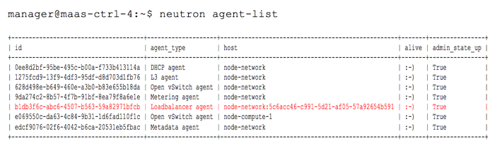

How to Deploy the F5 LBaaS Agent in OpenStack
------------------------

# Overview
Use the information in this guide to deploy the F5 LBaaS Agent in your OpenStack cloud.

## Prerequisites

- Install the [F5 LBaaS Plug-in]({{ f5-os-lbaasv1/index.html | prepend: site.url }}) before you deploy the Agent. 

- Set up at least one BIG-IP cluster - or, 'device service group \(DSG\)' -  before you deploy the Agent. You'll need administrator access to the BIG-IP and all cluster members.

**Tip:** Make note of the IP addresses and credentials for the devices in the cluster; you'll need to enter them in the Agent's config file\(s\).

- Agent configuration file\(s\) \([see Figure 1 (PDF)](lbaas-agent-config-sample.pdf)\). The installation will create a default config file, but you'll need a separate file for each agent you install. 

## Placement

You can run the F5 LBaaS agent on any host that has the Neutron python libraries installed. We recommend using a Neutron Controller or Gateway node, as they contain the appropriate libraries by default. You can also choose to run the agent on a dedicated node. 

We also recommend running multiple F5 LBaaS agents for the same environment simultaneously on different hosts, as doing so provides some redundancy in LBaaS provisioning for that environment. 

**Note:** If you choose to deploy multiple agents for the same environment, they *must* run on different hosts. 

You can run multiple F5 LBaaS agents simultaneously on the same host, but they must be orchestrating different environments \(in other words, different TMOS clusters with a different environment prefixes\). 

# Install the Agent

Use the command set for your OS to install the Neutron Gateway Packages for the LBaaS Agent.

## Ubuntu:

`dpkg -i f5-bigip-lbaas-agent_1.1.0-1_all.deb`

## Red Hat/CentOS:

`rpm -i f5-bigip-lbaas-agent-1.1.0-1.noarch.rpm`

**NOTE:** The actual file names will vary from version to version.

## Stop the Agent

The agent launches automatically on install; since it hasn't been configured yet, **run the appropriate command for your distro to stop the process**: 

## Ubuntu
`service f5-bigip-lbaas-agent stop`

To remove any error messages logged while the process ran, use the command `rm /var/log/neutron/f5-bigip-lbaas-agent.log`.

## RedHat / CentOS
???

## Installing Multiple Agents

If you wish to run multiple agents on separate hosts, complete both of the installation steps \(install, then stop\) on each host.

# Set up the Agent

The agent configuration settings are found in */etc/neutron/f5-bigip-lbaas-agent.ini*. A sample configuration file \(Figure 1\) explains the various available settings.

[View Figure 1 (PDF)](lbaas-agent-config-sample.pdf) 

## 4. Start the Agent

**NOTE:** If you want to start with clean logs, you should remove the log file first: `rm /var/log/neutron/f5-bigip-lbaas-agent.log`

Enter the following command to restart the agent:

`service f5-bigip-lbaas-agent restart`

# Check the Agent Status

Run the below command to check the agent status. 
`manager@maas-ctrl-4:\~\$ neutron agent-list`

**NOTE:** You may need to wait a few seconds after restarting the agent before it appears the list as shown in Figure 2.

If the agent does not start properly, an error will be logged in
the file */var/log/neutron/f5-bigip-lbaas-agent.log*.

# Enable LBaaS GUI in OpenStack

1. Go to the OpenStack cloud controller node.
2. In the 'local\_settings' file, change the 'enable\_lb' option to True.

The syntax will be something like the following:

"OPENSTACK\_NEUTRON\_NETWORK = { 'enable\_lb': True, ...}""

3. Restart the web server for the setting to take effect:
    `service httpd restart`

# Additional Information

## Tenant Scheduler

The F5 LBaaS Plug-in uses a scheduler which, by default, associates
all LBaaS pools with the same tenant on the same cluster. This association is maintained in the OpenStack database. 

To view the associations: 
    1. Run the command `neutron agent-list`. 
    2. Run `neutron lb-pool-list-on-agent &lt;agent-id&gt;` for each LBaaS agent.

If you add more agent-cluster groups, the LBaaS plug-in will automatically identify which agent it should talk to in order to service a given tenant. 

**NOTE:** If you delete all pools for a tenant, the record of how to map the tenant pool to an agent is also deleted. In such cases, the BIG-IP may choose a new agent for that tenant.
